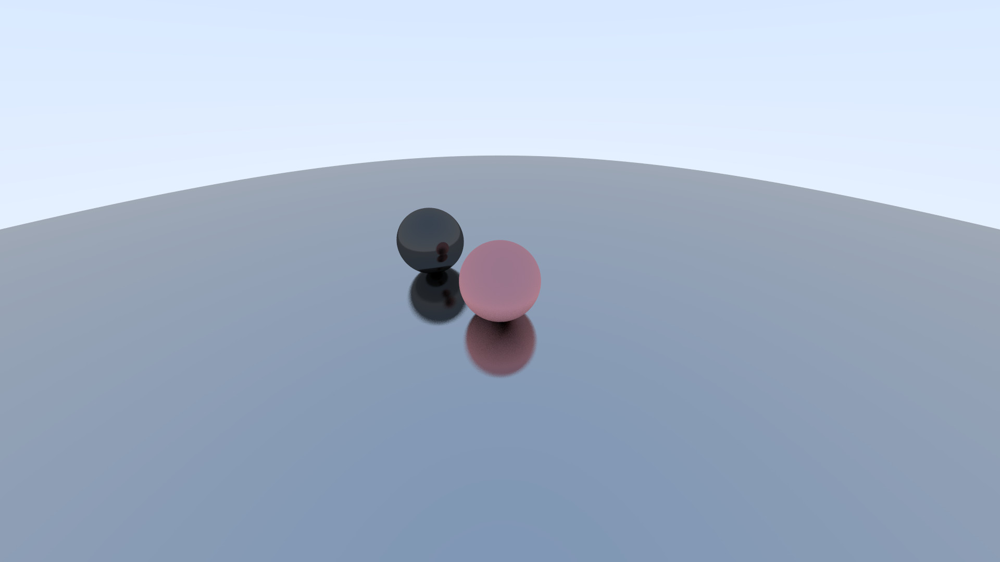

# RayTracing practice
A simple Ray Tracer made during my undergraduate period

# Feature
* Multithreaded rendering

# Compile
* CMake(cannot use)
* g++

# some display
complier: MSVC  
background: 3 spheres  
resolution: 1920x1080

|core|time|
|:----:|:----:|
|16|19s|  
|4|56s|  
|1|91s|

# Reference
Ray Tracing in One Weekend  
Ray Tracing: The Next Week  
Physically Based Rendering: From Theory to Implementation